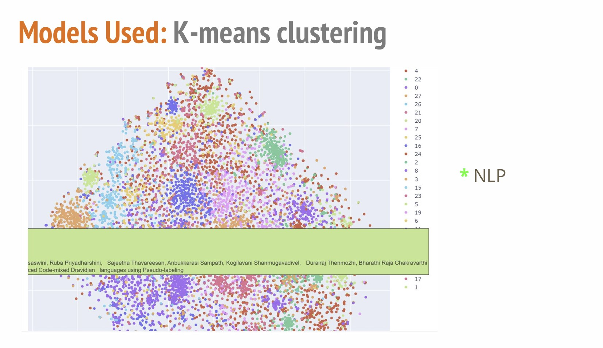
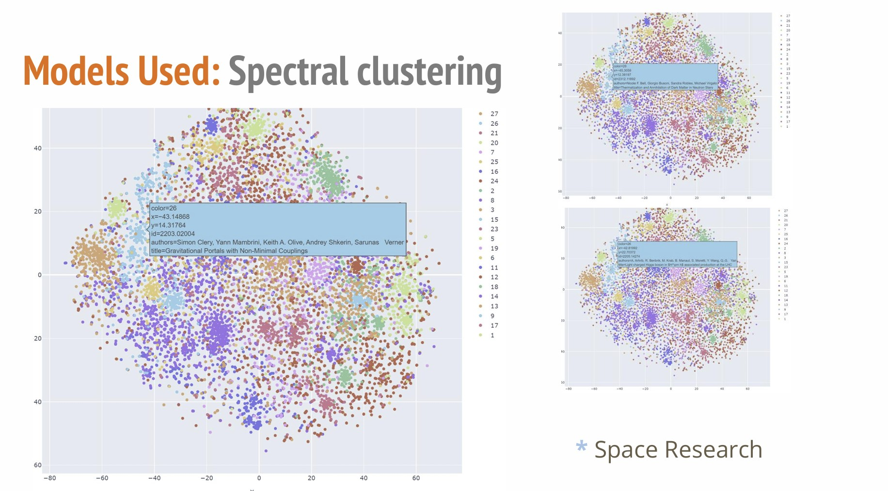

# ArXiv Dataset Research Paper Recommendation System

## Overview
This project addresses the challenge of navigating the vast landscape of academic research by developing a recommendation system based on **clustering techniques**. Using the **arXiv dataset**, the system groups research papers into meaningful categories and provides personalized recommendations to enhance accessibility and interdisciplinary collaboration.

---

## Objectives
- **Model Development**: Build a system to recommend research papers and categorize them based on thematic similarity.
- **Model Comparison**: Evaluate and compare the performance of **KMeans** and **Spectral Clustering**.
- **Deployment**: Host the recommendation system using **Streamlit** for easy access.

---

## Dataset
- **Source**: [ArXiv Dataset](https://www.kaggle.com/datasets/Cornell-University/arxiv)
- **Size**: 2M+ scholarly articles with 14 columns including:
  - **ID**, **Title**, **Authors**, **Abstract**, **Categories**, **Publication Year**.

---

## Machine Learning Models
- **Unsupervised Learning**:
  - **KMeans Clustering**: Groups papers based on compactness.
  - **Spectral Clustering**: Groups papers based on connectivity.
- **Evaluation Metrics**:
  - **Silhouette Score**, **Davis-Bouldin Index**, **Calinski-Harabasz Index**.



---

## Implementation Steps
1. **Data Preprocessing**:
   - Filtered papers published after 2020.
   - Removed duplicates and missing values.
   - Tokenized abstracts using `spaCy` and vectorized text using **TF-IDF**.
2. **Feature Engineering**:
   - Applied **PCA**, **t-SNE**, and **UMAP** for dimensionality reduction.
3. **Clustering**:
   - Used **Elbow Method** to select the optimal number of clusters (k=28).
   - Visualized clusters using 2D projection techniques.
4. **Recommendation System**:
   - Leveraged **Universal Sentence Encoder** to find similar papers.
   - Used a **K Neighbors Classifier** to suggest related research papers.
5. **Deployment**:
   - Hosted the model on **Streamlit** for interactive recommendations.

---

## Development Environment
- **Platform**: Kaggle Jupyter Notebook.
- **Tools**: `scikit-learn`, `spaCy`, `Streamlit`.
- **Languages**: Python.

---

## Results
- **Spectral Clustering** performed better than KMeans due to its connectivity-based approach, especially for interdisciplinary research.
- Recommendations are tailored using **semantic embeddings** for better relevance.

---

## Deployment
- Hosted on **Streamlit** for user-friendly access:
  ```bash
  streamlit run app.py
  ```

---

## Impact
- **Enhanced Research Efficiency**: Simplifies literature discovery for scholars.
- **Knowledge Accessibility**: Promotes inclusivity in academia.
- **Environmental Sustainability**: Reduces reliance on physical research libraries.

---

## Future Work
- Improve personalization using user feedback.
- Expand the recommendation system to support multilingual research papers.
- Incorporate advanced clustering techniques for emerging research trends.

---
